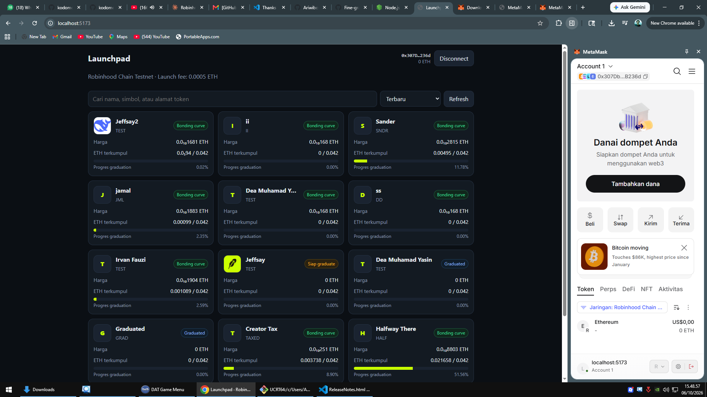
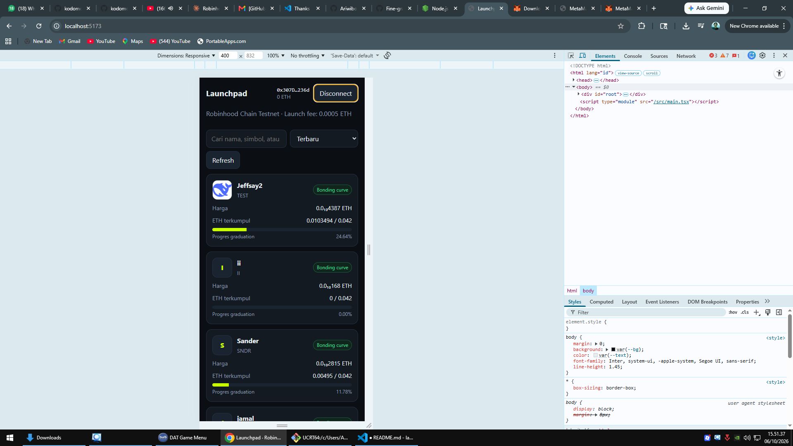
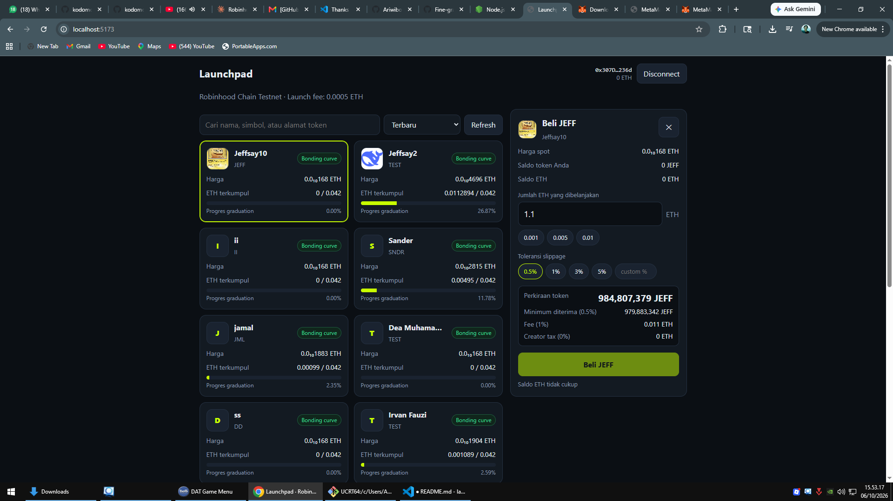
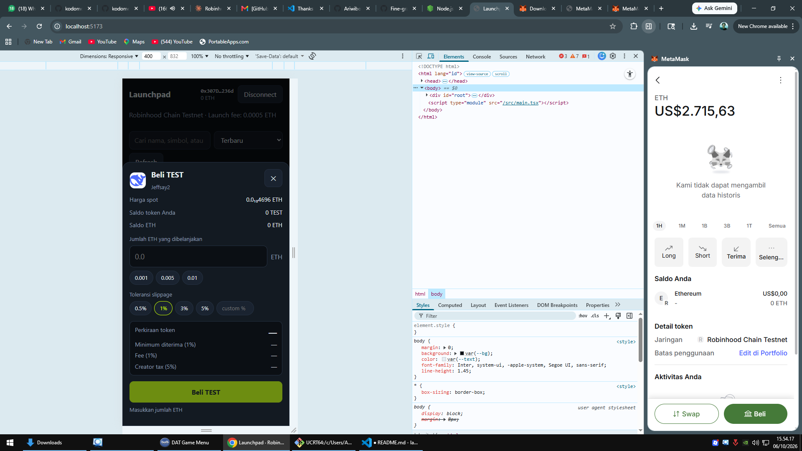
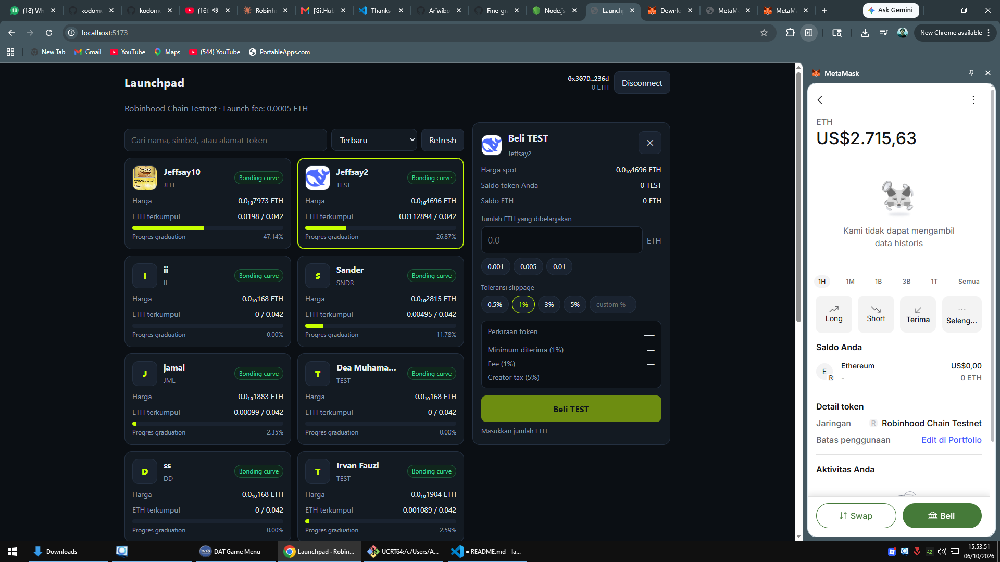
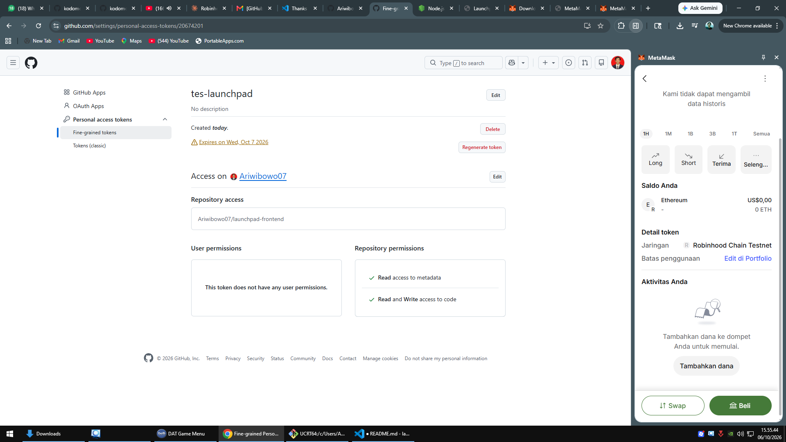
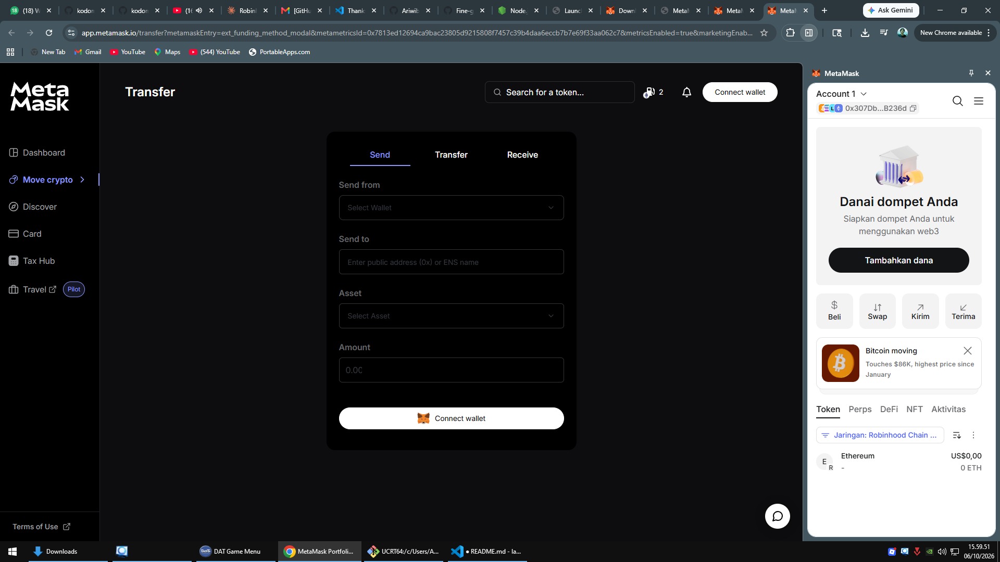
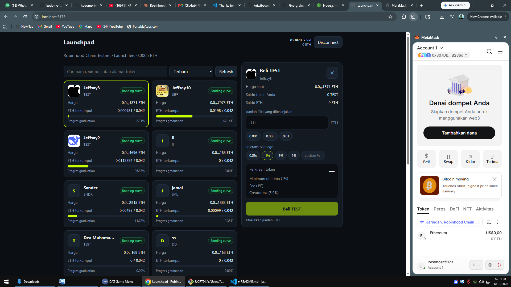
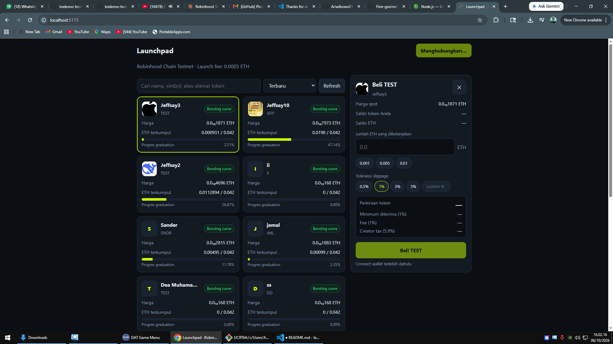

# Demo

Screenshot aplikasi yang berjalan di Robinhood Chain Testnet.

## 1. Wallet terhubung (alamat + saldo ETH)

## 2. Peringatan network salah + tombol pindah network

## 3. Daftar token (desktop)

## 4. Daftar token (HP)

## 5. Form beli dengan perkiraan token

## 6. Konfirmasi di wallet

## 7. Pembelian berhasil + link explorer

## 8. Token GRAD: tombol beli nonaktif

## 9. State loading / kosong / gagal

